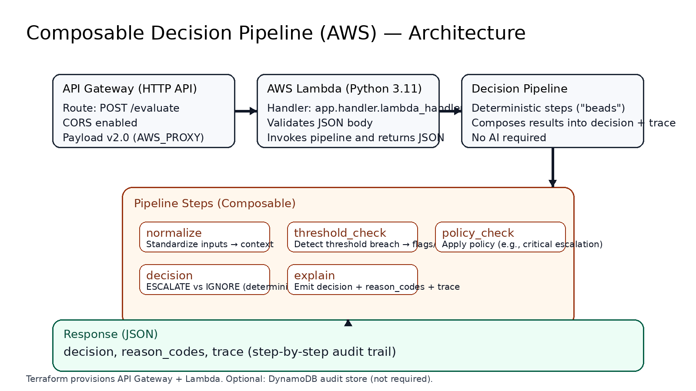

# Composable Decision Pipeline (AWS)

A minimal AWS reference implementation of a **composable, deterministic decision pipeline** that produces:

- a final decision (`ESCALATE` / `IGNORE`)
- reason codes (why the decision happened)
- a step-by-step trace (audit trail)

This is intentionally **not an AI project**. The point is to demonstrate how to build automation that is:

- **Explainable by construction** (no black box)
- **Governable** (explicit logic and traceability)
- **Composable** (small steps you can add/reorder safely)

---

## Architecture



**AWS components**
- **API Gateway (HTTP API)** — `POST /evaluate`
- **AWS Lambda (Python 3.11)** — executes the pipeline and returns JSON
- **Terraform** — provisions all infrastructure

Flow: API Gateway → Lambda → decision pipeline → JSON response (`decision`, `reason_codes`, `trace`)

---

## What the pipeline does

The pipeline is a sequence of small steps (composable decision units) that each:
- consumes structured input
- produces structured output
- appends a trace event

Current steps:
1. `normalize`
2. `threshold_check`
3. `policy_check`
4. `decision`
5. `explain`

---

## API

### Endpoint
`POST /evaluate`

### Response shape
```json
{
  "decision": "ESCALATE",
  "reason_codes": ["THRESHOLD_BREACH", "CRITICAL_SERVICE"],
  "trace": [
    { "bead": "normalize", "outcome": "ok" },
    { "bead": "threshold_check", "outcome": "triggered" },
    { "bead": "policy_check", "outcome": "triggered" },
    { "bead": "decision", "outcome": "ESCALATE" },
    { "bead": "explain", "outcome": "ok" }
  ]
}
